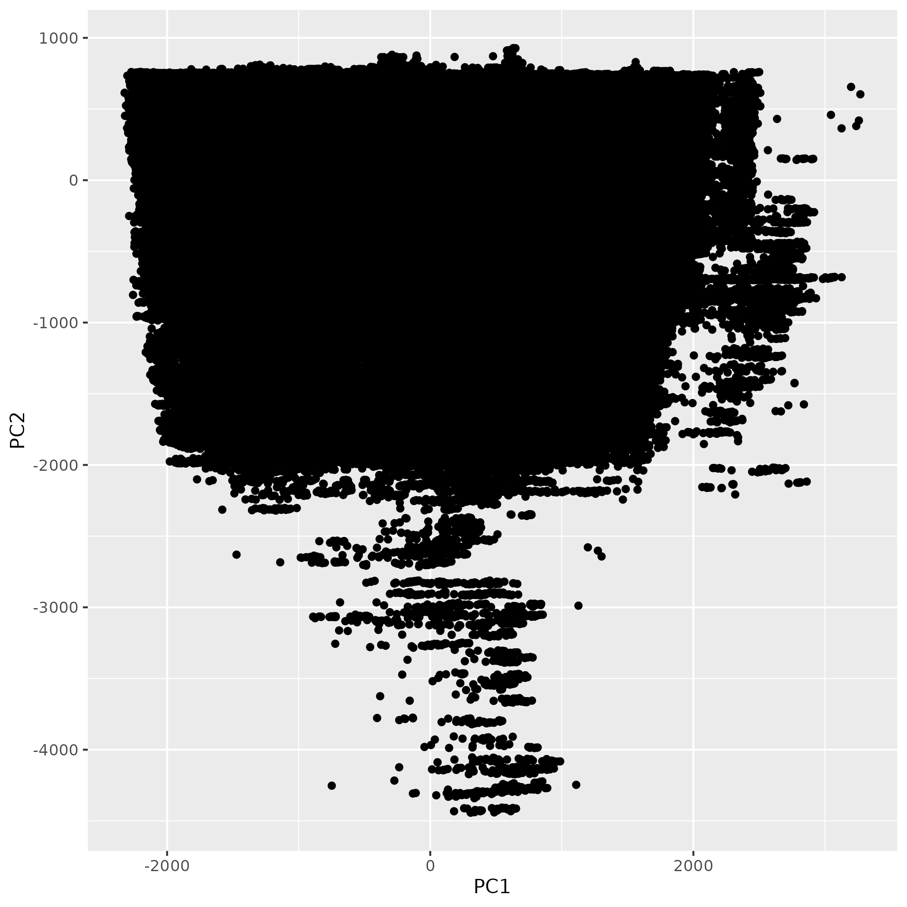

# Preliminary Data Investigation

In this project, we will be investigating US flight delay data from 2022. This data was taken from Arvind Nagaonkar's larger Flight Delay dataset on Kaggle (https://www.kaggle.com/datasets/arvindnagaonkar/flight-delay/data), which contains flight data from the Bureau of Transportation Statistics from January 2018 - April 2023. However, due to the size of the whole data set (~6 GB), we choose to only look at a subset of data, flights from 2022, for this project. We chose data from 2022 as it is representative of a nearly back-to-normal post-pandemic world. Thus, the trends we find should be the most similar to present day and useful for future predictions. We also chose to randomly sample one third of the data by month to maintain the uniform distribution of flights month by month. 

Specifically, our data set contains observations of flights in 2022. As mentioned by Arvind Nagaonkar on his Kaggle notebook, the data includes information about flights' scheduled and actual departure and arrival times. Note that this data set focuses on delayed flights, not cancelled or diverted flights. A detailed description of the columns can be found at the Kaggle link above.

First, we import our csv data set and explore the size and quality of the data. We check the number of observations and columns and in the data set, validate that the data types of each column variable are sensible, and check for any missing values.

When we examine the data types of each variable, we see that all of the data types look correct. Importantly, our date variable is numeric and also split into separate columns for day, month, and year. Thus, we can add/subtract integers to dates to move forward/backward in time, and we can easily work with individual days, months, and years if needed. Most of the other columns represent an amount of time, and all units are set to minutes, as specified in the Kaggle write up. We note that the last column looks irrelevant, so it can be removed. We also see that there are no missing values represented by NA in the data. In later histograms or barplots, if we come across any unusual values, we will be sure to consider the possibility of them representing missingness in the data and adjust our dataframe if necessary.

### Data Cleaning Check

As a sanity check, let's first investigate the Time variables in our data to see if they make sense.

We need to ensure that departure time is always less than Arrival time. Let's see how many observations exist in our data for which this does NOT hold true, and what percentage of observations they represent. About 4.5% of the observations have a departure time that is greater than the arrival time. 

As a reminder, the departure and arrival times are formatted as "HHMM", i.e. hours and minutes. Note that since these are numeric data types, it does not make sense to add and subtract integers from them. By examining a sample of data above, at first glance it seems odd that there are arrival times with less than 4 digits. However, we then realize that the missing leading digits are simply ones, as the "HHMM" format is in military (24-hour) time. Thus, `610` really means `0610` like 6:10am, and `7` really means `0007` like 12:07am. Let us quickly verify that for all the "time" variables in "HHMM" format, i.e. `CRSDepTime`, `DepTime`, `CRSArrTime`, `ArrTime`, `WheelsOff`, and `WheelsOn`, that the "HH" part is always between 0 and 24 and that the "MM" part is always between 0 and 59. We do this in our data cleaning script as well. Finally, we also add these hours and minutes individually as columns in our dataframe for any future use.

## Initial EDA

Now that we have verified that our Time variables look okay, we will now make some plots to visualize some univariate distributions and bivariate relationships in our data.

### Univariate EDA

#### Barplot of flights in 2022 by Month

{width=50%}

We see that the distribution of flights in our data set is relatively uniform across 2022. There is a slight increase in flights in the summer months compare to the winter months, with July 2022 having the most flights and February 2022 having the least. This seems sensible due to the cold weather in February (in most of the country). Additionally, most kids are on summer vacation in July so we expect vacations to be quite common that month.

#### Histogram of Departure Times

```{r, warning=FALSE, message=FALSE}

# hist_deptime <- ggplot(df_new) + 
#                   geom_histogram(aes(x=DepTime,y=after_stat(count)),fill='tomato2', alpha=0.5) +
#                   geom_histogram(aes(x=CRSDepTime,y=after_stat(count)),fill='turquoise1', alpha=0.3) +
#                   labs(title="Distribution of Flights in 2022 by Time \n 
#                               Blue = Schedule Departure Time \n 
#                               Red = Actual Departure Time", 
#                        x='Time of day', y='Number of flights', fill="Legend") 
# hist_deptime

```

***figure out a real legend for the above plot

In the plot above, we show the distributions of flights throughout the day in 2022. The blue histogram shows the scheduled departure times, the red shows the actual departure times, and the grey is where they overlap. Note that most flights start departing from 5am onwards, which explain the dip in the histogram at the start of the day. We can look at the differences between these histograms to answer the following question: at what times of the day are the scheduled and actual departure times for flights very different? When the blue parts are "sticking out" that means that more flights were scheduled for that time than the number that actually left at that time, and when red sticks out, that means that more flights left at that time than actually scheduled. We see more red later in the day and more blue earlier in the day, which makes sense as it represents flights that got delayed earlier in the day leaving later.

### Bivariate EDA

#### Bar plot of Weather Delays by Airline Code

{width=50%}

The most flight delays due to weather (in terms of total minutes delayed) occur from American Airlines, Delta, and Southwest, which make sense because they are the most popular airlines and probably have the most flights to begin with. We should consider scaling this plot by the total number of flights, as this would be more meaningful for comparison. (Will do later)


# More to come! There are a lot more relationships distributions to look into.

## Dimensionality Reduction

### Principal Component Analysis

We now apply PCA to the flight delay dataset for the purposes of dimensionality reduction. First, we subset only the numeric columns of the data (end of "R_scripts/data_clean.r"), and then we applied PCA ("R_scripts/pca.r"). Then, we plotted the principal components against the cumulative variance explained. 

{width=50%}

From this, we notice that the first 7-8 components explain 100% of the variance in the data. The first 3-4 components itself explain over 95% of the variance in the data. 

When we plot PC1 vs PC2 we see a very interesting geographical structure in the plot. 

{width=50%}

Specifically, the plot looks like a map of the United States! There is no information 
in the numeric dataframe about the flight cities or any latitudes and longitudes. 
There is only data about times and distance (in miles) between airports. Given that 
there are nearly 2 million flights in our dataset (which only represents one-third 
of 2022 flights), it makes sense that most combinations of airports around the 
country are represented such that the inherent geographical structure in the data 
is revealed by the first two principal components. 

### Clustering???


## Modeling

### Regression model 1


### regression model 2??


## Discussion and Future Work

